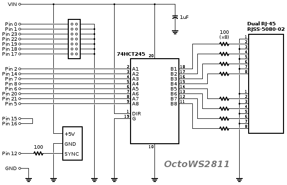
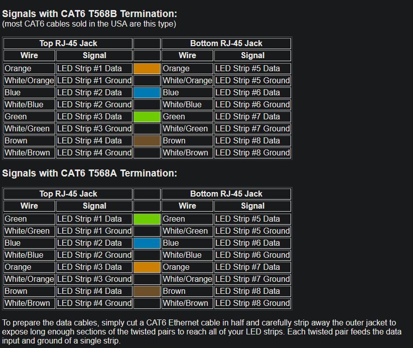

# Baldr

## Teensy Lighting Firmware for Thor Mutant Vehicle Art Car

### Hardware
Teensy 3.6 (or up to 4.1) with OctoWS2811:  https://www.pjrc.com/store/octo28_adaptor.html

https://www.pjrc.com/teensy/td_libs_OctoWS2811.html

==========

Lighting Panel is 1920 pixels arranged with 16 rows (8 outputs from one side that snake back to same side for 16 rows) and 120 columns.

2812B Addressable LEDs. 3x 60Ax5V (300W) power supplies in parallel.

**Limitations**
(per Teesny)

What limits the number of LEDs can you use with each Teensy?

1872: Teensy 3.0's RAM limit (90% used)

4320 tested in this project

4416: 60 HZ refresh

6000: 120V USA power*

8800: 30 Hz refresh (uses 86% of Teensy 3.2's available RAM)

10920: Limit due to DMA hardware, 1365 LEDs per pin, using 8 pins
(Teensy 4.x can use more pins)

To connect more LEDs, use multiple Teensy and OctoWS2811 Adaptors with their SYNC signals tied together.

* - Approximate, based on typical power supply efficiency and standard 15 amp circuit breakers

### Schematic

### OctoWS2811 Pinouts

## Programs

Burning Bus - Fire program based on 

Control thousands of WS2811/2812 LEDs at video refresh speeds

http://www.pjrc.com/teensy/td_libs_OctoWS2811.html

https://www.youtube.com/watch?v=M5XQLvFPcBM

## Installation

Install ArduinoIDE 2.x.x from either your package manager or download installer from [https://www.arduino.cc/en/software](https://www.arduino.cc/en/software) then go to the settings page, add the Teensyduino source https://www.pjrc.com/teensy/package_teensy_index.json and then click on the Boards Manager and search for Teensy and install the board support.

## Files

### Fire Animation
> Location: Fire/ThorPanelFire.ino